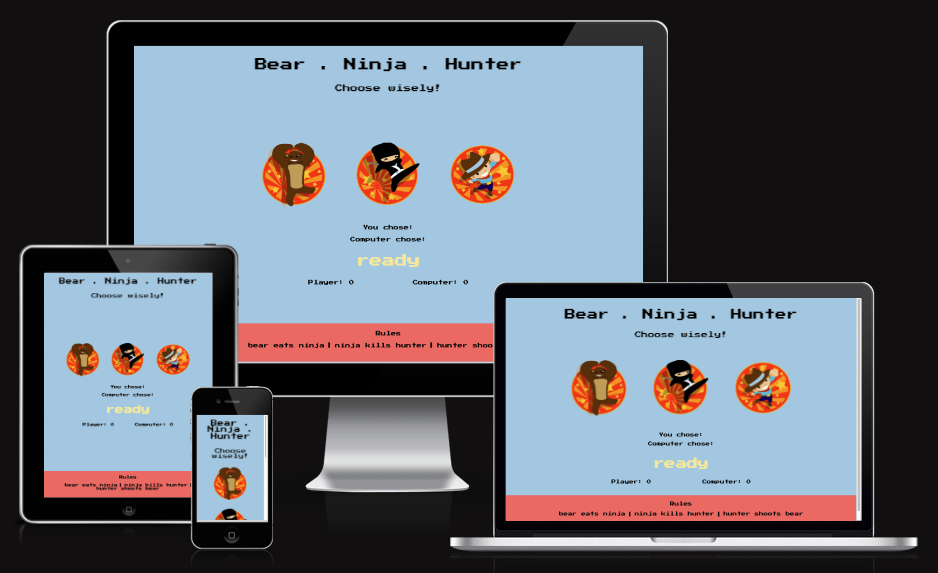
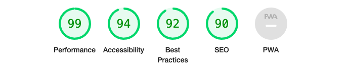

# Bear.Ninja.Hunter

Bear.Ninja.Hunter is a web browser based rock, paper, scissors type game. In this case bear eats ninja, ninja kills hunter and hunter shoots bear. It's a simple retro styled arcade game designed to give the user a relaxing gaming experience while enjoying nostalgic graphics and soothing colours. 

When the player or the computer wins 5 points, the winner is declared and the scores are reset. Whether you're a kid playing at home on an iPad, or an office worker looking for a quick distraction at work, this game has got you covered!

# UX

This game is designed to give the player a relaxing gaming experience while enjoying retro graphics. Simple pseudo styles are added to the selectors to give the player a deeper sense of engagement with the game. Sound effects are used when the player has won a turn.

# UI

The player interacts with the computer with a left mouse click.

# Design

**Imagery**

Each choice is represented with an image. When hovered over, the images are enlarged. Whenever a character loses a turn, their image will be replaced with a corresponding 'sad' image.

**Fonts**

I'm using the font [Press Start P2](https://fonts.google.com/specimen/Press+Start+2P), which is a bitmap font based on the font design from 1980s Namco arcade games. Incase the user's browser doesn't support this font I'm using sans-serif as a back up.

**Colours**

To achieve a retro, stylish and vibrant look, I'm using the following colours.

- #A8D0E6 is used for the background.
- #F76C6C is used for the footer.
- #F8E9A1 is used for the game outcome text.

The rest of the text is plain black.

# Features

* **Header**

    - The game has a simple header with the title of the game and a subheading that reminds the player that they have to make a choice to start the game.

* **Game Area**

    - The game area consists of the selection area, where the images represent the choices the player can make. Underneath that, the outcomes and scores are displayed, along with some text declaring the winner/loser.

 

* **Footer**

    -  There is a simple footer with the rules of the game.

# Game functionality

This game is created using JavaScript. The computer randomly generates a number between 1-3 whenever the player clicks on their choice. This number is assigned a choice, and a winner is declared for each point. When the player or the computer reaches 5 points, the round winner is declared, and the points reset.

# Deployment

This website has been deployed to GitHub using the following steps:

1. Within the Github repository, navigate to the settings tab.
2. From the source section drop-down menu, select the main branch.
3. Press save to receive a link to the completed website - [bear.ninja.hunter](https://axelzwaans.github.io/bear.ninja.hunter/)

# Testing

I have tested the game functionality and the following functions are being executed without error;

  - When hovered over, the selector images enlarge.
  - When a selector image is clicked, the computer generates a random choice and compares the value to the player's value.
  - The announcement text declares winner/loser.
  - Scores are tracked and displayed.
  - After 5 points, the game resets.

I have also tested the website on various screen sizes for responsiveness, including tablets and phones, to ensure that the media queries achieve the desired result. 

**Validator Testing**

 - HTML
     - I used [The W3C Markup Validation Service](https://validator.w3.org/) to validate the html. No errors were found.

   - CSS
     - I used [The W3C CSS Validation Service](https://jigsaw.w3.org/css-validator/) to validate the CSS. No errors were found.

   - Responsiveness
     - I used [Am I Responsive](http://ami.responsivedesign.is/) to validate responsive on different devices.

   - DevTools
     - I used [Chrome Devtools](https://developer.chrome.com/docs/devtools/) for general code and responsiveness testing.

   - Lighthouse
     - I used Lighthouse to check performance & accessibility. Results are displayed below.

**Bugs**

There are no bugs present in the current version of the project. 

# Credits

**Content**

  - For coding guidance to set up the game I used [this youtube tutorial](https://www.youtube.com/watch?v=RwFeg0cEZvQ&t=568s).
  - For coding related questions I used [Stackoverflow](https://stackoverflow.com/) and [w3schools](https://www.w3schools.com/).
  - The font is taken from [Google Fonts](https://fonts.google.com/).

**Media**

  - All images were downloaded from [pinterest.com](www.pinterest.com). 

